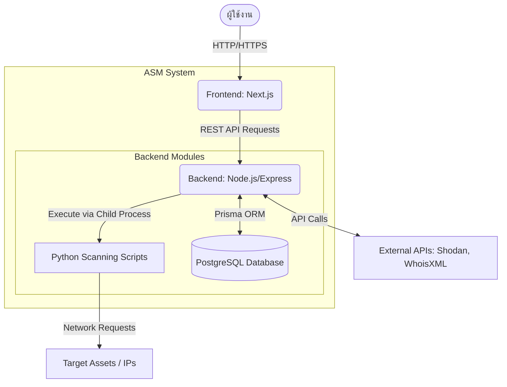
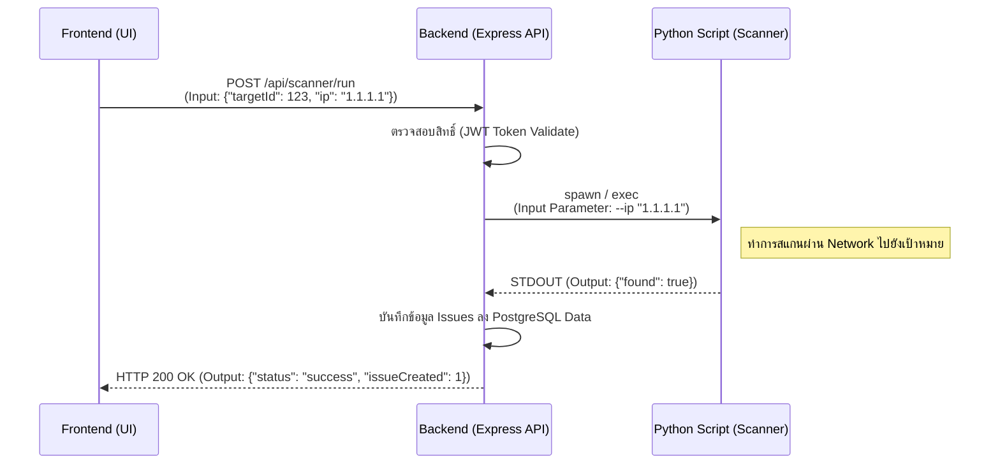

# คู่มือสำหรับนักพัฒนาโปรแกรม (Developer Guide)
**โครงการ: Attack Surface Management (ASM)**

เอกสารฉบับนี้จัดทำขึ้นเพื่อนักพัฒนาโปรแกรมหรือผู้ที่ต้องการนำระบบไปพัฒนาต่อ โดยสรุปภาพรวมในรูปแบบ Top-Down ตั้งแต่สถาปัตยกรรมระบบ โครงสร้างไฟล์ ไปจนถึงการทำงานของโปรแกรมย่อยและพารามิเตอร์ที่ใช้ในการรับส่งข้อมูล

---

## 1. การออกแบบและสถาปัตยกรรม (Top-Down Architecture)

โปรแกรมถูกออกแบบด้วยสถาปัตยกรรม **Client-Server** แบบแยกส่วน (Decoupled) ในโครงสร้างแบบ Monorepo ทำให้สามารถดูแลรักษาชุดคำสั่งได้ง่าย โปรแกรมนี้สามารถแบ่งออกเป็นโมดูลหลัก (Modules) 3 ส่วน ได้แก่:

1.  **Frontend (UI Module):** ทำหน้าที่ติดต่อกับผู้ใช้งาน รับคำสั่ง และแสดงผลหน้าจอ
2.  **Backend (API Module):** ทำหน้าที่เป็นตัวกลางประมวลผลโลจิก (Business Logic) ติดต่อฐานข้อมูล และประสานงาน
3.  **Scanning (Python Engine):** โปรแกรมย่อยเพื่อทำการทดสอบและประเมินช่องโหว่

### แผนภาพความสัมพันธ์ระดับบนสุด (System Architecture Diagram)



---

## 2. โครงสร้างของโปรแกรมและการแบ่งโมดูล (Program Structure)

โปรแกรมประกอบด้วยไฟล์หลักจำนวนมาก (มากกว่า 100 ไฟล์เมื่อรวมทั้งโปรเจกต์) โดยมีการรวมและจัดระเบียบแบ่งเป็นโฟลเดอร์หรือ **โปรแกรมย่อย (Sub-programs)** หลักๆ ดังนี้:

### 2.1 โมดูล Backend (`apps/console/`)
ประกอบด้วยไฟล์ Source code สำคัญประมาณ 15-20 ไฟล์ หน้าที่หลักคือการตอบสนองคำร้องขอจาก Frontend 
*   **`src/index.ts` (1 ไฟล์รวบรวมระบบ):** จุดศูนย์กลางการทำงานของเซิร์ฟเวอร์ โหลดค่า Configuration และตั้งค่า Middleware 
*   **โปรแกรมย่อยกลุ่ม Routes (`src/routes/*.ts`):** 
    ประกอบด้วยไฟล์ย่อยประมาณ 9 ไฟล์ เช่น `assets.ts`, `issues.ts`, `scanner.ts` ทำหน้าที่รับ Input Parameter จาก Frontend ผ่าน URL และ Body จากนั้นประมวลผล 
    **หน้าที่:** ดึงข้อมูลจาก Database หรือเรียกใช้ Python Script
*   **โปรแกรมย่อยกลุ่ม Database (`prisma/schema.prisma`):**
    เก็บโครงสร้างตารางข้อมูลทั้งหมด และใช้ Prisma Client ในการเขียน/อ่านฐานข้อมูล

### 2.2 โมดูล Frontend (`apps/web-console/`)
พัฒนาด้วย Next.js และแบ่งออกเป็นส่วนย่อยหลายไฟล์ (Page และ Component) 
*   **`src/app/` (โปรแกรมย่อยกลุ่ม Pages):** หน้าจอต่างๆ เช่น Dashboard, Login, การตั้งค่า
*   **`src/components/` (โปรแกรมย่อยกลุ่ม UI):** ชิ้นส่วนหน้าจออิสระ (Reusable Components) ที่ใช้ซ้ำในหลายๆ หน้า ช่วยลดความซ้ำซ้อนของโค้ด

### 2.3 โมดูลโปรแกรมสแกนช่องโหว่ (`apps/console/python_modules/`)
เป็นชุด **โปรแกรมย่อยอิสระ (Sub-programs)** จำนวน 7 ไฟล์หลักที่เขียนด้วย Python เช่น `openssl_vuln.py`, `redirect_http.py` ทำหน้าที่สแกนหาสิ่งผิดปกติและช่องโหว่เฉพาะจุด 

---

## 3. การทำงานของโปรแกรมย่อยและพารามิเตอร์ (Sub-program Workflows)

เพื่อให้เห็นภาพการทำงานร่วมกันอย่างชัดเจน จะขอยกตัวอย่าง **โปรแกรมย่อยด้านการสแกนหาช่องโหว่ (Vulnerability Scanner)** ว่ามีการส่งพารามิเตอร์และ Output กันอย่างไร

### 3.1 Flowchart การทำงานเมื่อสั่งรันสแกนช่องโหว่



### 3.2 รายละเอียดของ Input, Output และ Parameters

#### 1) การเชื่อมต่อระหว่าง Frontend และ Backend (REST API)
ใช้รูปแบบ JSON เป็นมาตรฐานสำหรับการคุยกัน:
*   **Input (จาก Frontend -> Backend):** 
    ส่งผ่าน HTTP Request Body (สำหรับ POST/PUT) หรือ Query String (สำหรับ GET) 
    *   *ตัวอย่างพารามิเตอร์ (Parameter):* `{ "domain": "example.com" }` หรือ `?page=1&limit=10`
*   **Output (จาก Backend -> Frontend):**
    *   *รูปแบบผลลัพธ์:* JSON Object
    *   *ตัวอย่าง:* `{ "target": "example.com", "subdomains": [...] }`

#### 2) การเชื่อมต่อระหว่าง Backend (Node.js) และ Python Modules
เนื่องจากเป็นการเรียกใช้โปรแกรมคนละภาษา Backend จึงเรียก Python ผ่าน Command Line Interface (CLI):
*   **Input (ส่งเป็น Arguments):**
    Backend จะสั่งรันคำสั่ง: `python ./apps/console/python_modules/openssl_vuln.py --ip <IP_ADDRESS>`
    *   *พารามิเตอร์ส่งเข้า (Input Parameter):* `--ip` ตามด้วยค่าไอพีของสินทรัพย์ (Asset) ที่ต้องการตรวจสอบ
*   **Output (รับค่ากลับผ่าน Standard Output (STDOUT)):**
    Python จะทำงานและทำการปริ้นคำคอบกลับมาเป็น string ในรูปแบบ JSON เสมอ เช่น:
    ```json
    {
      "found": true
    }
    ```
    หรือมี error message ออกมา Backend จะจับผลลัพธ์ที่อยู่ในรูปแบบ JSON ไปแปลงตีความ (parse) และทำการบันทึกลงฐานข้อมูลต่อไป

---

## 4. ส่วนเชื่อมต่อฮาร์ดแวร์ / วงจร (Hardware / Circuit)

> *หมายเหตุ: โปรเจกต์นี้เป็นโครงงานด้านระบบสารสนเทศส่วนซอฟต์แวร์ (Software Engineering Project) เป็นหลัก ไม่มีวงจรฮาร์ดแวร์ หรือการสร้างแผงวงจรอิเล็กทรอนิกส์เข้ามาเกี่ยวข้องแต่อย่างใด ฮาร์ดแวร์ที่ใช้มีเพียง Server ทั่วไปสำหรับการรันโปรแกรมตามที่ได้ระบุไว้ใน System Requirements ในไฟล์ Installation Guide.*
